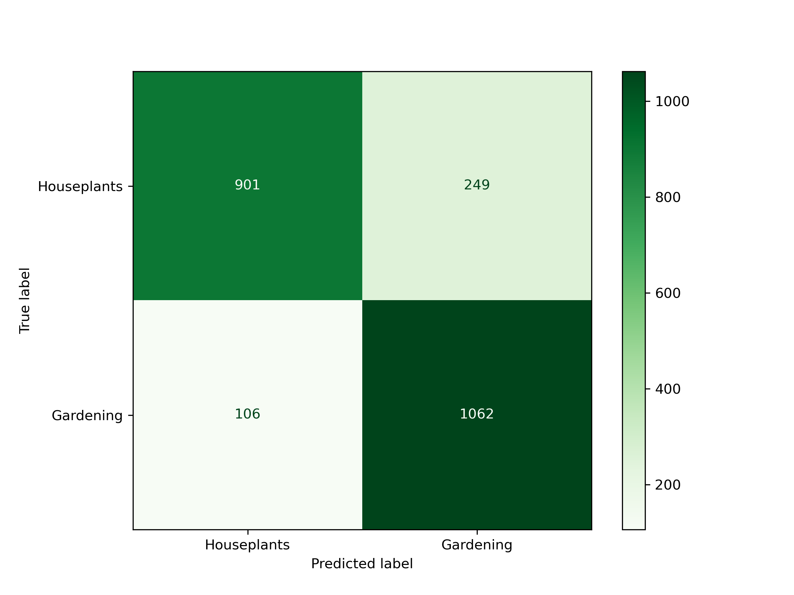
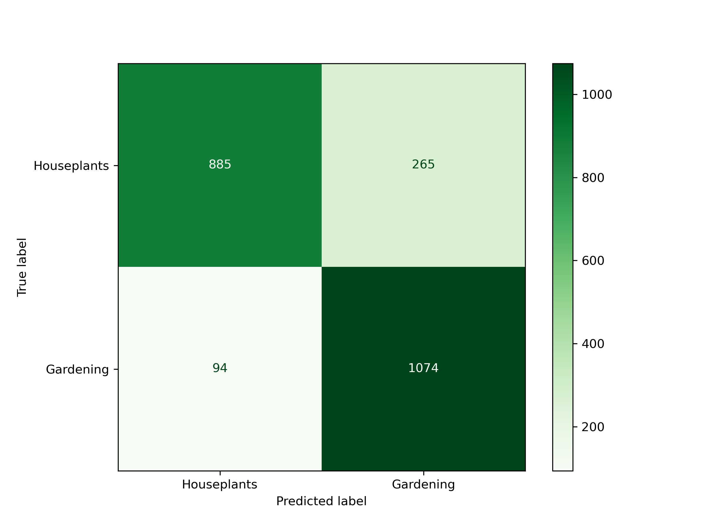

# Binary Classification Models: /r/houseplants - /r/gardening 
## Subreddit Classification based on Post Titles

## Overview
This project aims to explore and distinguish between posts from two Reddit communities—/r/houseplants and /r/gardening—by classifying posts based on their titles. The overarching goal is to build a robust binary classification model that can predict which subreddit a given post belongs to, based on the language and content in the title.

Understanding the distinctions between these communities not only deepens insight into user behavior and language patterns but also opens the door for applications in content recommendation, community analysis, and digital marketing strategies.

## Data Dictionary
| Feature       | Type    | Description                                             |
|---------------|---------|---------------------------------------------------------|
| id            | string  | Unique identifier for the Reddit post                   |
| created_utc   | integer | The timestamp of when the Reddit post was created      |
| title         | string  | The title of the Reddit post                            |
| self_text     | string  | The text content of the Reddit post                     |
| comments      | integer | The number of comments on the Reddit post               |
| score         | integer | The score (upvotes - downvotes) of the Reddit post      |
| upvote_ratio  | float   | The ratio of upvotes to the total votes for the post    |
| subreddit     | integer | The source subreddit: 'houseplants' (1) or 'gardening' (0) |

## Executive Summary

The project's primary objectives are as follows:
- Collect and analyze Reddit posts to gain insights into the distinct characteristics of the "houseplants" and "gardening" subreddits.
- Develop a classification model that accurately predicts the subreddit (houseplants or gardening) based on post text content with at least 80% accuracy on testing datasets.

To accomplish these goals, data was scraped from Reddit using the PRAW library. After data cleaning and EDA, binary classification models were created utilizing logistic regression and extra tree classifiers.

Data Sources:
- www.reddit.com/r/houseplants/
- www.reddit.com/r/gardening/

## Data Collection
The PRAW (Python Reddit API Wrapper) Library was utilized to collect a total of 12,052 posts from /r/houseplants and /r/gardening utilizing the following filters:
- new
- hot
- rising
- top (all, year, month, week)

The following features were retrieved during data collection:
- id
- created_utc
- title
- self_text
- comments
- score
- upvote_ratio
- subreddit

This data was saved to two csv files for cleaning: 'houseplants.csv' and 'gardening.csv'.

## Data Cleaning
Data cleaning involved handling null values and making the dataset suitable for analysis:
- Imported houseplants and gardening csv files as individual dataframes
- Concatenated both dataframes together
- Dropped 2781 duplicate rows.
- Filled null values appropriately
- Dummified the subreddit column to create a binary target variable (1 for "houseplants" and 0 for "gardening")

## EDA (Exploratory Data Analysis)
EDA was performed to gain insights into the data:
- Examined correlations between features such as post comments, scores, and upvote ratios
- Employed count vectorization to discover the most frequently used words in both subreddits

## Modeling

### Model 1: Count Vectorization / Logistic Regression
Model 1 utilized count vectorization in conjunction with the logistic regression classifier.

#### Data Loading: 
The dataset 'plants.csv' was loaded into a Pandas DataFrame named 'plants.' The 'title' column was defined as the feature ('X'), while the 'subreddit' column was used as the target variable ('y').

#### Train-Test Split: 
The dataset was split into training and testing sets using train_test_split, reserving 25% of the data for testing.

#### Custom Stop Words: 
A list of custom stop words was created, which included words like 've,' 'help,' and 'little,' in addition to common English stop words. All stop words were combined into the 'all_stop_words' list.

#### Benchmark Model: 
A benchmark model was set up with Count Vectorization (cvec_bench) and Logistic Regression (log_reg_bench) using a simple pipeline. It was trained on the training data, and its accuracy on both the training and testing sets was calculated.

#### Tuned Model: 
A more sophisticated tuned model was created using a pipeline with Count Vectorization and Logistic Regression. A grid search (GridSearchCV) was performed to identify the best hyperparameters through cross-validation.
|   Hyperparameter  | Model 1 Value |
|-------------------|---------|
| cvec max df       | 0.9     |
| cvec min df       | 1       |
| cvec max features | None    |
| cvec n gram range | (1,2)   |
| cvec stop words   | English + Custom |

#### Model Evaluation: 
The model's performance was assessed by calculating the accuracy scores on the training and testing sets. Confusion matrices were generated to visualize true positives, true negatives, false positives, and false negatives. A classification report was printed, providing precision, recall, F1-score, and support for each subreddit class. Additionally, the model identified and displayed misclassified posts, along with their true and predicted labels.

#### Model Results:
|      Metric    | Model 1 Score |
| ------------- | ------- |
| Baseline      | 0.489   |
| Benchmark Training | 0.937 |
| Benchmark Testing  | 0.837 |
| Tuned Training  | 0.977   |
| Tuned Testing   | 0.846   |

##### Interpretation:
The model achieved a high training accuracy of 97.74%, indicating strong performance on the training data. However, the gap between training and testing accuracy suggests potential overfitting.

The testing accuracy of 84.69% reflects good generalization to new data. More importantly, the classification report shows that precision and recall are well-balanced between both classes, with F1-scores close in value. This suggests that the model does not heavily favor either /r/houseplants or /r/gardening and performs consistently across both communities.

Addressing overfitting may involve adjusting model complexity, regularization, or dataset size.
Further hyperparameter tuning may optimize testing data performance.
Further text preprocessing may also increase model performance. Self-text and numerical features may be considered in future model iterations.

### Model 2: Count Vectorization/ Extra Trees Classifier
In the second model, Count Vectorization was used in conjunction with the Extra Trees classifier.

#### Data Loading:
The cleaned dataset 'plants.csv' was loaded into a Pandas DataFrame named 'plants.' The 'title' column was defined as the feature ('X'), while the 'subreddit' column was used as the target variable ('y').

#### Train-Test Split: 
The data was divided into training and testing sets using train_test_split, reserving 25% of the data for testing.

#### Benchmark Model: 
The model set up a benchmark with Count Vectorization (cvec_bench) and the Extra Trees Classifier (et_bench) using a pipeline. The benchmark model was trained on the training data, and its accuracy on both the training and testing sets was calculated.

#### Tuned Model: 
The tuned model was created using a pipeline that combined Count Vectorization and the Extra Trees Classifier. A grid search (GridSearchCV) was performed to find the best hyperparameters using cross-validation.
|     Hyperparameter  | Model 2 Value|
|---------------------|---------|
| cvec max df         | 0.9     |
| cvec min df         | 1       |
| cvec max features   | None    |
| cvec n gram range   | (1,2)   |
| cvec stop words     | None    |
| et max depth        | None    |
| et max features     | sqrt    |
| et min samples leaf | 1       |
| et n estimators     | 500     |

#### Model Evaluation: 
The model's performance was evaluated by calculating the accuracy scores on the training and testing sets. Confusion matrices were generated to visualize true positives, true negatives, false positives, and false negatives. A classification report was printed, providing precision, recall, F1-score, and support for each subreddit class. Additionally, the model identified and displayed misclassified posts, along with their true and predicted labels.

#### Feature Importance: 
The model calculated and visualized the feature importances from the best estimator. The top 20 most important features were displayed in a horizontal bar chart.

#### Model Results:
|      Metric   | Model 2 Score |
| ------------- | ------- |
| Baseline      | 0.489   |
| Benchmark Training | 0.995 |
| Benchmark Testing  | 0.839 |
| Tuned Training  | 0.995   |
| Tuned Testing   | 0.845   |

##### Interpretation:
Model 2 achieved extremely high training accuracy (99.5%), correctly classifying nearly all training examples. However, the near-perfect training performance alongside lower test accuracy (84.5%) suggests overfitting.

Despite this, precision and recall scores remain balanced across both subreddit classes, indicating that the model still generalizes reasonably well. The F1-scores for both /r/houseplants and /r/gardening are comparable to those of Model 1, reinforcing that the model is not biased toward a specific class.

The Extra Trees Classifier also provides feature importance scores, offering insight into which terms most influenced the classification decision. However, due to the model's complexity, individual decisions are harder to interpret compared to logistic regression.

### Tabulated Result Comparison
| Model                    | Baseline | Benchmark Training | Benchmark Testing | Tuned Training | Tuned Testing |
|--------------------------|----------|--------------------|-------------------|---------------|--------------|
| Model 1, cvec/log_reg    | 0.489    | 0.937              | 0.837             | 0.977         | 0.846        |
| Model 2, cvec/extra trees| 0.489    | 0.995              | 0.839             | 0.995         | 0.845        |

### Conclusion
Both models demonstrated strong predictive performance, achieving testing accuracies in the 84–85% range. However, the logistic regression model (Model 1) has two key advantages:

1. **Interpretability** – Logistic regression offers transparency in how input features influence predictions, which is valuable for model auditing and communication.
2. **Balanced Performance** – Precision, recall, and F1-scores for both classes are nearly identical, showing that the model treats both subreddits equitably.

These characteristics make Model 1 the preferred candidate for deployment, especially in user-facing or content moderation contexts where explainability and fairness matter.

